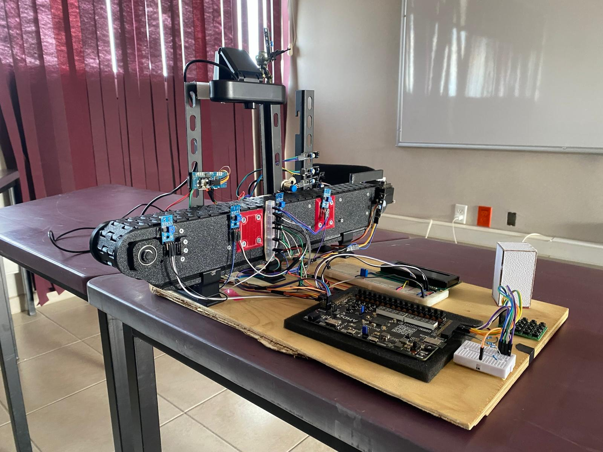

# 🏭 Banda4Bits Chido 1.0

> Sistema de clasificación de objetos con interfaz de menú LCD y control de motor implementado en VHDL para FPGA Boolean Board.

<div align="center">
  
  <br><br>
  <video src="https://raw.githubusercontent.com/victor22-te/Banda-Transportadora-VHDL/main/assets/video-clasificacion.mp4" width="600" controls autoplay loop muted></video>
</div>

---

## 📋 Descripción General

Este proyecto implementa un **sistema de clasificación de objetos** sobre una banda transportadora. El usuario selecciona las características del objeto a buscar (color, tamaño y propiedades magnéticas) a través de un menú interactivo en un **LCD 20x4** controlado por un **teclado matricial 4x4**. Una vez configurado, el sistema usa un **sensor infrarrojo** para detectar objetos y controla un **motor DC** mediante un puente H L298N.

---

## 🎯 Características Principales

| Característica | Descripción |
|----------------|-------------|
| **Menú LCD interactivo** | Navegación por menús en LCD 20x4 |
| **Teclado matricial 4x4** | Entrada de usuario con antirrebote |
| **4 Sensores infrarrojos** | IR1 (inicio), IR2 (magnético), IR3 (color), IR4 (final) |
| **Sensor magnético** | Detecta si el objeto es magnético (1) o no (0) |
| **Cámara + Red Neuronal** | Clasificador de color (Blanco/Negro/Rojo) con TensorFlow |
| **Comunicación UART** | Serial 9600 baud entre FPGA y PC |
| **Control de motor DC** | Uso de puente H L298N |
| **FPGA Boolean Board** | Plataforma de desarrollo (Xilinx Spartan-7) |

---

## 📁 Estructura del Proyecto

```
Banda4Bits_chido1.0/
├── Banda4Bits_chido1.0.srcs/
│   ├── sources_1/new/
│   │   ├── BandaChido.vhd        # 🧠 Módulo principal (menú + lógica + UART)
│   │   ├── ControlMotor.vhd      # ⚙️ Control del motor (L298N)
│   │   ├── InfraRojo.vhd         # 📡 Sensor IR con debounce
│   │   ├── Teclado.vhd           # ⌨️ Teclado matricial 4x4
│   │   ├── ProcesadorLCD.vhd     # 📺 Procesador LCD 4 bits
│   │   ├── ComandosLCD.vhd       # 📚 Librería de comandos LCD
│   │   └── Caracteres.vhd        # 🔤 Definición de caracteres
│   └── constrs_1/new/
│       └── constBanda.xdc        # 📌 Asignación de pines
├── venv/                          # 🐍 Entorno virtual Python
├── color_nn_data/                 # 💾 Datos y modelo entrenado
├── ColorNN.py                     # 🎨 Clasificador de colores con Red Neuronal
├── requirements.txt               # 📦 Dependencias Python
├── run_colornn.bat                # ▶️ Script para ejecutar ColorNN
├── Banda4Bits_chido1.0.xpr        # 📄 Archivo proyecto Vivado
└── README.md                      # 📖 Este archivo
```

---

## 🔌 Conexiones de Hardware

### Pinout de la Boolean Board

| Señal | Pin FPGA | Descripción |
|-------|----------|-------------|
| `CLK` | F14 | Reloj 100 MHz |
| `SW_RESET` | V2 | Switch para reiniciar desde resumen |
| `IR_IN` | R7 | Sensor infrarrojo 1 (inicio) |
| `IR_IN2` | R6 | Sensor infrarrojo 2 (sensado magnético) |
| `IR_IN3` | P6 | Sensor infrarrojo 3 (sensado color) |
| `IR_IN4` | N4 | Sensor infrarrojo 4 (punto final) |
| `MAGNETIC_IN` | T4 | Sensor magnético (1=magnético, 0=no) |
| `UART_RX` | V12 | Recepción serial desde PC/cámara |
| `UART_TX` | U11 | Transmisión serial hacia PC |

### LCD 20x4 (Modo 4 bits)

| Señal | Pin FPGA |
|-------|----------|
| `RS` | N5 |
| `ENA` | K4 |
| `RW` | A16 |
| `DATA_LCD[0]` | T3 |
| `DATA_LCD[1]` | M4 |
| `DATA_LCD[2]` | R4 |
| `DATA_LCD[3]` | L5 |

### Teclado Matricial 4x4

| Señal | Pin FPGA |
|-------|----------|
| `COLUMNAS[0-3]` | A13, D12, B13, E12 |
| `FILAS[0-3]` | A14, C14, B14, C13 |

### Motor (Puente H L298N)

| Señal | Pin FPGA | Descripción |
|-------|----------|-------------|
| `MOTOR_ENA` | T6 | Enable motor |
| `MOTOR_IN1` | T5 | Dirección 1 |
| `MOTOR_IN2` | R5 | Dirección 2 |

### LEDs de Depuración

| Señal | Pines FPGA |
|-------|------------|
| `LEDS[0-3]` | G1, G2, F1, F2 |

---

## 📱 Flujo del Menú

El sistema tiene **5 estados de menú**:

```
┌──────────────────────────────────────────────┐
│  ESTADO 0: MENÚ PRINCIPAL                    │
│  ┌────────────────────────┐                  │
│  │ Elija una opcion       │                  │
│  │                        │                  │
│  │                        │                  │
│  │ Enter p/aceptar        │                  │
│  └────────────────────────┘                  │
│              │ Presiona F                    │
│              ▼                               │
│  ESTADO 1: SELECCIÓN DE COLOR                │
│  ┌────────────────────────┐                  │
│  │ Elija un color         │                  │
│  │ 1)Blanco 2)Negro       │                  │
│  │ 3)Rojo                 │                  │
│  │ Enter p/aceptar        │                  │
│  └────────────────────────┘                  │
│              │ Presiona F                    │
│              ▼                               │
│  ESTADO 2: SELECCIÓN DE TAMAÑO               │
│  ┌────────────────────────┐                  │
│  │ Elija un tamaño        │                  │
│  │ 1)Baja 2)Media         │                  │
│  │ 3)Alta                 │                  │
│  │ Enter p/aceptar        │                  │
│  └────────────────────────┘                  │
│              │ Presiona F                    │
│              ▼                               │
│  ESTADO 3: PROPIEDAD MAGNÉTICA               │
│  ┌────────────────────────┐                  │
│  │ Magnetico?             │                  │
│  │ 1)Si 2)No              │                  │
│  │                        │                  │
│  │ Enter p/aceptar        │                  │
│  └────────────────────────┘                  │
│              │ Presiona F                    │
│              ▼                               │
│  ESTADO 4: PANTALLA RESUMEN                  │
│  ┌────────────────────────┐                  │
│  │ Objeto elegido:        │                  │
│  │ [Color seleccionado]   │                  │
│  │ [Altura seleccionada]  │                  │
│  │ [Magnetico/No Mag.]    │                  │
│  └────────────────────────┘                  │
│      * Motor activo cuando IR detecta        │
│      * SW_RESET para volver a Estado 0       │
└──────────────────────────────────────────────┘
```

### Controles del Teclado

| Tecla | Función |
|-------|---------|
| `1` | Seleccionar opción 1 |
| `2` | Seleccionar opción 2 |
| `3` | Seleccionar opción 3 |
| `F` | Enter/Confirmar selección |

---

## ⚙️ Funcionamiento del Sistema

### Proceso de Sensado Automático Completo

El sistema implementa una **máquina de estados** para el proceso de clasificación con 4 sensores infrarrojos:

```
┌─────────────┐     IR1 detecta    ┌─────────────┐
│    IDLE     │─────objeto───────▶│  ESPERA_IR2 │
│ Motor OFF   │                    │  Motor ON   │
└─────────────┘                    └──────┬──────┘
      ▲                                   │
      │ Reset menú                        │ IR2 detecta
      │                                   ▼
┌─────────────┐                    ┌──────────────┐
│ PARADO_IR4  │                    │PAUSA_MAGNETICO│
│ Motor OFF   │                    │  Motor OFF   │
│ (Fin ciclo) │                    │ 3.5 segundos │
└─────────────┘                    └──────┬───────┘
      ▲                                   │
      │ IR4 detecta                       ▼
      │                            ┌──────────────┐
┌─────────────┐                    │LEYENDO_MAGNET│
│AVANZANDO_IR4│                    │  Motor OFF   │
│  Motor ON   │                    │Lee magnético │
└─────────────┘                    └──────┬───────┘
      ▲                                   │
      │                                   ▼
      │                            ┌──────────────┐
      │                            │AVANZANDO_IR3 │
      │                            │  Motor ON    │
      │                            └──────┬───────┘
      │                                   │
      │                                   │ IR3 detecta
      │                                   ▼
      │                            ┌──────────────┐
      │                            │ PAUSA_COLOR  │
      │                            │  Motor OFF   │
      │                            │ 3.5 segundos │
      │                            └──────┬───────┘
      │                                   │
      │                                   ▼
      │                            ┌──────────────┐
      │                            │ESPERANDO_CLR │
      └────────────────────────────│Recibe serial │
                                   │(color cámara)│
                                   └──────────────┘
```

### Estados del Proceso

| Estado | Motor | Descripción |
|--------|-------|-------------|
| `IDLE` | OFF | Esperando que IR1 detecte un objeto |
| `ESPERA_IR2` | ON | Banda avanzando hacia IR2 |
| `PAUSA_MAGNETICO` | OFF | **Espera 3.5 segundos** en IR2 para sensado magnético |
| `LEYENDO_MAGNETICO` | OFF | Lee y guarda el valor del sensor magnético |
| `AVANZANDO_A_IR3` | ON | Banda avanzando hacia IR3 |
| `PAUSA_COLOR` | OFF | **Espera 3.5 segundos** en IR3 para sensado de color |
| `ESPERANDO_COLOR` | OFF | Espera a recibir código de color por serial (UART) |
| `AVANZANDO_A_IR4` | ON | Banda avanzando hacia IR4 (punto final) |
| `PARADO_IR4` | OFF | **Fin del ciclo**, objeto en IR4, muestra resultados |

### Sensores

#### Sensores Infrarrojos
- **IR_IN (IR1)**: Sensor de inicio - detecta cuando un objeto entra a la banda
- **IR_IN2 (IR2)**: Punto de sensado magnético - pausa 3.5 segundos para medir
- **IR_IN3 (IR3)**: Punto de sensado de color - pausa 3.5 segundos para cámara
- **IR_IN4 (IR4)**: Sensor final - punto de parada al terminar el proceso
- Los sensores IR dan `'0'` cuando **detectan** un objeto
- El módulo `InfraRojo.vhd` **invierte la lógica** para facilitar su uso
- Incluye **debouncing** de 10ms por defecto

#### Sensor Magnético
- **MAGNETIC_IN**: Entrada del sensor magnético (pin T4)
  - `'1'` = Objeto es **magnético**
  - `'0'` = Objeto **NO es magnético**
- La lectura se guarda internamente en `lectura_magnetico`

#### Comunicación Serial (UART 9600 baud)
- **UART_RX** (pin V12): Recibe código de color desde PC/cámara
  - `0x01` → Blanco
  - `0x02` → Negro  
  - `0x03` → Rojo
- **UART_TX** (pin U11): Transmite resultados de la clasificación

---

## 🚀 Cómo Usar

### Requisitos

- **Vivado 2020.1** o superior
- **Boolean Board** (Spartan-7 XC7S50)
- LCD 20x4 con controlador HD44780
- Teclado matricial 4x4
- Sensor infrarrojo (ej. TCRT5000)
- Módulo puente H L298N
- Motor DC

### Pasos para Sintetizar e Implementar

1. Abre Vivado y carga el proyecto:
   ```
   File → Open Project → Banda4Bits_chido1.0.xpr
   ```

2. Ejecuta la síntesis:
   ```
   Flow Navigator → Run Synthesis
   ```

3. Ejecuta la implementación:
   ```
   Flow Navigator → Run Implementation
   ```

4. Genera el bitstream:
   ```
   Flow Navigator → Generate Bitstream
   ```

5. Programa la FPGA:
   ```
   Flow Navigator → Open Hardware Manager → Program Device
   ```

### Operación

1. **Enciende** el sistema y espera que aparezca el menú principal
2. Presiona **`F`** para comenzar la configuración
3. Selecciona el **color** deseado (teclas 1, 2 o 3) y presiona **`F`**
4. Selecciona el **tamaño/altura** deseado y presiona **`F`**
5. Selecciona si es **magnético** o no y presiona **`F`**
6. En la pantalla de **resumen**, el proceso automático comienza:
   - IR1 detecta objeto → **Motor enciende**
   - Objeto llega a IR2 → **Motor para por 1.5 segundos**
   - Se lee el **sensor magnético** automáticamente
   - **Motor enciende** de nuevo
   - Objeto llega a IR3 → **Motor para** (fin del ciclo)
7. Usa **SW_RESET** para reiniciar y configurar nuevos parámetros

---

## 📦 Módulos VHDL

### `BandaChido.vhd` (Módulo Principal)
- **Entidad**: `LIB_LCD_MENU_TECLADO`
- Controla la máquina de estados del menú
- Máquina de estados de sensado con 4 sensores IR
- **Receptor UART** integrado (9600 baud) para recibir color de cámara
- **Transmisor UART** para enviar resultados
- Maneja la lógica del motor y tiempos de pausa (3.5 segundos)

### `ControlMotor.vhd`
- Control simple de motor DC con L298N
- Señales: `AVANZAR` → Motor adelante, `!AVANZAR` → Motor detenido

### `InfraRojo.vhd`
- Sensor IR con debouncing configurable
- Parámetros genéricos: `FPGA_CLK`, `DEBOUNCE_TIME_MS`

### `Teclado.vhd`
- Teclado matricial 4x4 con antirrebote
- Lectura por barrido de filas

### `ProcesadorLCD.vhd` + `ComandosLCD.vhd`
- Controlador LCD 4 bits con funciones de alto nivel
- Soporta posicionamiento, caracteres, bucles

---

## 🎨 ColorNN - Clasificador de Colores con Red Neuronal

Sistema de visión por computadora que clasifica colores usando TensorFlow.

### Instalación

```bash
# El entorno virtual ya está creado en venv/
# Activar entorno y ejecutar:
.\run_colornn.bat

# O manualmente:
.\venv\Scripts\activate
python ColorNN.py
```

### Controles de ColorNN

| Tecla | Función |
|-------|---------|
| `1` | Seleccionar clase Blanco para captura |
| `2` | Seleccionar clase Negro para captura |
| `3` | Seleccionar clase Rojo para captura |
| `C` | Capturar muestra del color actual |
| `T` | Entrenar modelo con datos capturados |
| `R` | Resetear datos de entrenamiento |
| `Q` | Salir |

### Flujo de Uso

1. **Capturar datos**: Coloca objetos de cada color frente a la cámara
   - Presiona `1`, `2` o `3` para seleccionar el color
   - Presiona `C` para capturar muestras (mínimo 10 por color recomendado)
   
2. **Entrenar modelo**: Presiona `T` para entrenar la red neuronal
   - El modelo se guarda automáticamente en `color_nn_data/`
   
3. **Clasificar**: Una vez entrenado, clasifica automáticamente
   - Envía código por serial cuando detecta con confianza >70%

### Códigos Binarios Enviados

| Color | Código | Byte (hex) |
|-------|--------|------------|
| Blanco | "01" | 0x01 |
| Negro | "10" | 0x02 |
| Rojo | "11" | 0x03 |

### Configuración

Edita las variables al inicio de `ColorNN.py`:

```python
CAMERA_INDEX = 1      # Índice de cámara (0=integrada, 1=USB)
SERIAL_PORT = "COM3"  # Puerto serial
BAUD_RATE = 9600      # Velocidad de comunicación
```

---

## 🐛 Troubleshooting

| Problema | Solución |
|----------|----------|
| LCD no muestra nada | Verifica conexiones y contraste del LCD |
| Teclado no responde | Revisa que FILAS sean salidas y COLUMNAS entradas |
| Motor no gira | Verifica alimentación del L298N (12V separados) |
| Sensor no detecta | Ajusta la distancia y verifica la conexión |

---

## 📝 Notas de Desarrollo

- El proyecto usa un reloj de **100 MHz** (Boolean Board)
- El LCD opera en **modo 4 bits** para ahorrar pines
- Los LEDs (4) muestran la tecla actualmente presionada

---

## 👨‍💻 Autores

### * **Victor Francisco Villafaña Hernández**
### * **Carlos Alberto García Mera**

---
