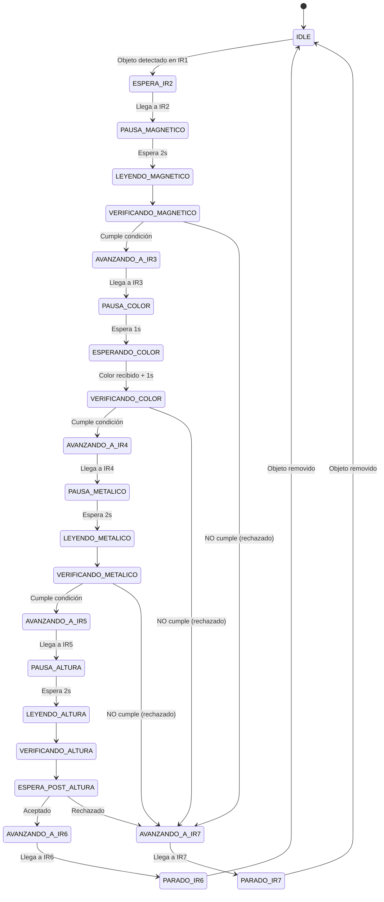
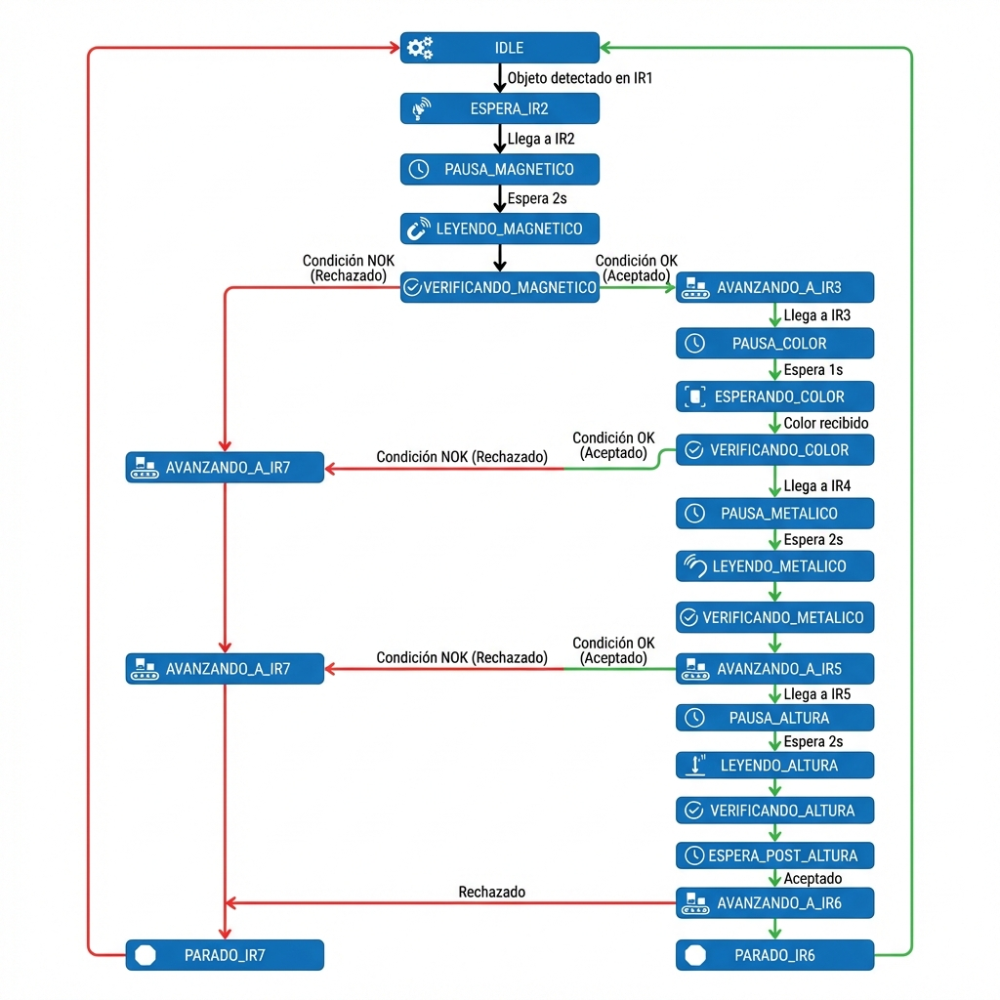

# Reporte Técnico: Sistema de Banda Transportadora con Clasificación de Objetos

## 📋 Resumen Ejecutivo

Este documento analiza el código VHDL de un sistema de banda transportadora automatizada con clasificación de objetos. El sistema utiliza múltiples sensores (infrarrojos, magnéticos, metálicos y de altura) para detectar y clasificar objetos según criterios definidos por el usuario a través de un menú LCD interactivo.

---

## 🎯 Entidad Principal

### `LIB_LCD_MENU_TECLADO`

**Archivo:** [BandaChido.vhd](file:///c:/Users/Spider-Man/Banda4Bits_chido1.0/Banda4Bits_chido1.0.srcs/sources_1/new/BandaChido.vhd#L7-L50)

#### Parámetros Genéricos
- `FPGA_CLK`: Frecuencia del reloj (100 MHz por defecto)

#### Puertos de Entrada

| Puerto | Tipo | Descripción |
|--------|------|-------------|
| `CLK` | STD_LOGIC | Reloj del sistema (100 MHz) |
| `SW_RESET` | STD_LOGIC | Switch para reset desde pantalla resumen |
| `SW_START` | STD_LOGIC | Switch para modo continuo/pausado |
| `BTN_RESET` | STD_LOGIC | Botón para resetear contadores |
| `IR_IN` | STD_LOGIC | Sensor infrarrojo 1 (detección inicial) |
| `IR_IN2` | STD_LOGIC | Sensor infrarrojo 2 (punto sensado magnético) |
| `IR_IN3` | STD_LOGIC | Sensor infrarrojo 3 (punto sensado color) |
| `IR_IN4` | STD_LOGIC | Sensor infrarrojo 4 (punto sensado metálico) |
| `IR_IN5` | STD_LOGIC | Sensor infrarrojo 5 (punto sensado altura) |
| `IR_IN6` | STD_LOGIC | Sensor infrarrojo 6 (punto final aceptados) |
| `IR_IN7` | STD_LOGIC | Sensor infrarrojo 7 (punto final rechazados) |
| `IR_HEIGHT1` | STD_LOGIC | Sensor de altura 1 (base - todos los objetos) |
| `IR_HEIGHT2` | STD_LOGIC | Sensor de altura 2 (mediano y grande) |
| `IR_HEIGHT3` | STD_LOGIC | Sensor de altura 3 (solo grande) |
| `MAGNETIC_IN` | STD_LOGIC | Sensor magnético (1=magnético, 0=no magnético) |
| `METALIC_IN` | STD_LOGIC | Sensor metálico (1=metálico, 0=no metálico) |
| `UART_RX` | STD_LOGIC | Recepción serial desde cámara |
| `COLUMNAS` | STD_LOGIC_VECTOR(3:0) | Columnas del teclado matricial 4x4 |

#### Puertos de Salida

| Puerto | Tipo | Descripción |
|--------|------|-------------|
| `FILAS` | STD_LOGIC_VECTOR(3:0) | Filas del teclado matricial 4x4 |
| `RS, RW, ENA` | STD_LOGIC | Señales de control LCD |
| `DATA_LCD` | STD_LOGIC_VECTOR(3:0) | Datos LCD (modo 4 bits) |
| `LEDS` | STD_LOGIC_VECTOR(3:0) | LEDs de debug |
| `MOTOR_ENA` | STD_LOGIC | Enable del motor L298N |
| `MOTOR_IN1, MOTOR_IN2` | STD_LOGIC | Control de dirección del motor |
| `SERVO_OUT` | STD_LOGIC | Señal PWM para servo clasificador |
| `D0_AN, D0_SEG` | STD_LOGIC_VECTOR | Display 7 segmentos (aceptados) |
| `D1_AN, D1_SEG` | STD_LOGIC_VECTOR | Display 7 segmentos (rechazados) |
| `UART_TX` | STD_LOGIC | Transmisión serial para debug |

---

## 🔧 Componentes Instanciados

### 1. **Teclado Matricial 4x4**
**Componente:** `LIB_TEC_MATRICIAL_4x4_INTESC_RevA`  
**Líneas:** [56-66](file:///c:/Users/Spider-Man/Banda4Bits_chido1.0/Banda4Bits_chido1.0.srcs/sources_1/new/BandaChido.vhd#L56-L66)  
**Instancia:** [428-437](file:///c:/Users/Spider-Man/Banda4Bits_chido1.0/Banda4Bits_chido1.0.srcs/sources_1/new/BandaChido.vhd#L428-L437)  
**Función:** Detecta pulsaciones en el teclado matricial con anti-rebote integrado

### 2. **Control de Motor**
**Componente:** `ControlMotor`  
**Líneas:** [69-78](file:///c:/Users/Spider-Man/Banda4Bits_chido1.0/Banda4Bits_chido1.0.srcs/sources_1/new/BandaChido.vhd#L69-L78)  
**Instancia:** [418-426](file:///c:/Users/Spider-Man/Banda4Bits_chido1.0/Banda4Bits_chido1.0.srcs/sources_1/new/BandaChido.vhd#L418-L426)  
**Función:** Controla el motor DC de la banda transportadora mediante driver L298N

### 3. **Sensores Infrarrojos (x7)**
**Componente:** `InfraRojo`  
**Líneas:** [81-92](file:///c:/Users/Spider-Man/Banda4Bits_chido1.0/Banda4Bits_chido1.0.srcs/sources_1/new/BandaChido.vhd#L81-L92)  
**Instancias:** 
- IR1: [262-272](file:///c:/Users/Spider-Man/Banda4Bits_chido1.0/Banda4Bits_chido1.0.srcs/sources_1/new/BandaChido.vhd#L262-L272)
- IR2: [275-285](file:///c:/Users/Spider-Man/Banda4Bits_chido1.0/Banda4Bits_chido1.0.srcs/sources_1/new/BandaChido.vhd#L275-L285)
- IR3: [288-298](file:///c:/Users/Spider-Man/Banda4Bits_chido1.0/Banda4Bits_chido1.0.srcs/sources_1/new/BandaChido.vhd#L288-L298)
- IR4: [301-311](file:///c:/Users/Spider-Man/Banda4Bits_chido1.0/Banda4Bits_chido1.0.srcs/sources_1/new/BandaChido.vhd#L301-L311)
- IR5: [314-324](file:///c:/Users/Spider-Man/Banda4Bits_chido1.0/Banda4Bits_chido1.0.srcs/sources_1/new/BandaChido.vhd#L314-L324)
- IR6: [327-337](file:///c:/Users/Spider-Man/Banda4Bits_chido1.0/Banda4Bits_chido1.0.srcs/sources_1/new/BandaChido.vhd#L327-L337)
- IR7: [340-350](file:///c:/Users/Spider-Man/Banda4Bits_chido1.0/Banda4Bits_chido1.0.srcs/sources_1/new/BandaChido.vhd#L340-L350)

**Función:** Detectan objetos con anti-rebote de 10ms

### 4. **Sensores de Altura (x3)**
**Componente:** `InfraRojo`  
**Instancias:**
- HEIGHT1: [353-363](file:///c:/Users/Spider-Man/Banda4Bits_chido1.0/Banda4Bits_chido1.0.srcs/sources_1/new/BandaChido.vhd#L353-L363)
- HEIGHT2: [365-375](file:///c:/Users/Spider-Man/Banda4Bits_chido1.0/Banda4Bits_chido1.0.srcs/sources_1/new/BandaChido.vhd#L365-L375)
- HEIGHT3: [377-387](file:///c:/Users/Spider-Man/Banda4Bits_chido1.0/Banda4Bits_chido1.0.srcs/sources_1/new/BandaChido.vhd#L377-L387)

**Función:** Determinan la altura del objeto (Chico/Mediano/Grande)

### 5. **Servo Clasificador**
**Componente:** `servo_control`  
**Líneas:** [95-101](file:///c:/Users/Spider-Man/Banda4Bits_chido1.0/Banda4Bits_chido1.0.srcs/sources_1/new/BandaChido.vhd#L95-L101)  
**Instancia:** [390-395](file:///c:/Users/Spider-Man/Banda4Bits_chido1.0/Banda4Bits_chido1.0.srcs/sources_1/new/BandaChido.vhd#L390-L395)  
**Función:** Controla servo para clasificar objetos (0° aceptado, 135° rechazado)

### 6. **Contador con Displays**
**Componente:** `Contador_Display`  
**Líneas:** [104-119](file:///c:/Users/Spider-Man/Banda4Bits_chido1.0/Banda4Bits_chido1.0.srcs/sources_1/new/BandaChido.vhd#L104-L119)  
**Instancia:** [398-412](file:///c:/Users/Spider-Man/Banda4Bits_chido1.0/Banda4Bits_chido1.0.srcs/sources_1/new/BandaChido.vhd#L398-L412)  
**Función:** Cuenta objetos aceptados/rechazados y los muestra en displays 7 segmentos (0-15)

### 7. **Procesador LCD**
**Componente:** `PROCESADOR_LCD4BITS_REVC`  
**Líneas:** [121-135](file:///c:/Users/Spider-Man/Banda4Bits_chido1.0/Banda4Bits_chido1.0.srcs/sources_1/new/BandaChido.vhd#L121-L135)  
**Instancia:** [439-451](file:///c:/Users/Spider-Man/Banda4Bits_chido1.0/Banda4Bits_chido1.0.srcs/sources_1/new/BandaChido.vhd#L439-L451)  
**Función:** Controla LCD 20x4 en modo 4 bits

---

## 🔄 Máquinas de Estados

### **Máquina de Estados Principal: Proceso de Sensado**

**Tipo:** `estado_sensado_t`  
**Definición:** [198-207](file:///c:/Users/Spider-Man/Banda4Bits_chido1.0/Banda4Bits_chido1.0.srcs/sources_1/new/BandaChido.vhd#L198-L207)  
**Proceso:** [554-873](file:///c:/Users/Spider-Man/Banda4Bits_chido1.0/Banda4Bits_chido1.0.srcs/sources_1/new/BandaChido.vhd#L554-L873)

#### Estados de la Máquina



**Diagrama Visual de la Máquina de Estados:**



#### Descripción de Estados Críticos

| Estado | Líneas | Función |
|--------|--------|---------|
| **IDLE** | [560-605](file:///c:/Users/Spider-Man/Banda4Bits_chido1.0/Banda4Bits_chido1.0.srcs/sources_1/new/BandaChido.vhd#L560-L605) | Espera detección de objeto en IR1. Gestiona modo continuo/pausado y timeout |
| **PAUSA_MAGNETICO** | [616-623](file:///c:/Users/Spider-Man/Banda4Bits_chido1.0/Banda4Bits_chido1.0.srcs/sources_1/new/BandaChido.vhd#L616-L623) | Pausa de 2 segundos para estabilizar sensor magnético |
| **VERIFICANDO_MAGNETICO** | [631-642](file:///c:/Users/Spider-Man/Banda4Bits_chido1.0/Banda4Bits_chido1.0.srcs/sources_1/new/BandaChido.vhd#L631-L642) | Compara lectura con criterio del usuario |
| **ESPERANDO_COLOR** | [666-678](file:///c:/Users/Spider-Man/Banda4Bits_chido1.0/Banda4Bits_chido1.0.srcs/sources_1/new/BandaChido.vhd#L666-L678) | Espera recepción de color por UART desde cámara |
| **VERIFICANDO_COLOR** | [680-692](file:///c:/Users/Spider-Man/Banda4Bits_chido1.0/Banda4Bits_chido1.0.srcs/sources_1/new/BandaChido.vhd#L680-L692) | Compara color detectado con criterio del usuario |
| **LEYENDO_ALTURA** | [749-762](file:///c:/Users/Spider-Man/Banda4Bits_chido1.0/Banda4Bits_chido1.0.srcs/sources_1/new/BandaChido.vhd#L749-L762) | Lee 3 sensores de altura y determina tamaño |
| **PARADO_IR6** | [804-826](file:///c:/Users/Spider-Man/Banda4Bits_chido1.0/Banda4Bits_chido1.0.srcs/sources_1/new/BandaChido.vhd#L804-L826) | Objeto aceptado, incrementa contador |
| **PARADO_IR7** | [836-858](file:///c:/Users/Spider-Man/Banda4Bits_chido1.0/Banda4Bits_chido1.0.srcs/sources_1/new/BandaChido.vhd#L836-L858) | Objeto rechazado, incrementa contador |

### **Máquina de Estados UART RX**

**Tipo:** `rx_state_t`  
**Definición:** [227](file:///c:/Users/Spider-Man/Banda4Bits_chido1.0/Banda4Bits_chido1.0.srcs/sources_1/new/BandaChido.vhd#L227)  
**Proceso:** [896-950](file:///c:/Users/Spider-Man/Banda4Bits_chido1.0/Banda4Bits_chido1.0.srcs/sources_1/new/BandaChido.vhd#L896-L950)

**Estados:** `RX_IDLE` → `RX_START` → `RX_DATA` → `RX_STOP`  
**Baud Rate:** 9600 bps  
**Función:** Recibe datos de color desde cámara externa

### **Máquina de Estados UART TX**

**Tipo:** `tx_state_t`  
**Definición:** [244](file:///c:/Users/Spider-Man/Banda4Bits_chido1.0/Banda4Bits_chido1.0.srcs/sources_1/new/BandaChido.vhd#L244)  
**Proceso:** [986-1034](file:///c:/Users/Spider-Man/Banda4Bits_chido1.0/Banda4Bits_chido1.0.srcs/sources_1/new/BandaChido.vhd#L986-L1034)

**Estados:** `TX_IDLE` → `TX_START` → `TX_DATA` → `TX_STOP`  
**Baud Rate:** 9600 bps  
**Función:** Envía resultados de clasificación

---

## 📡 Procesos Importantes

### 1. **Control del Menú con Anti-Debounce**
**Líneas:** [456-539](file:///c:/Users/Spider-Man/Banda4Bits_chido1.0/Banda4Bits_chido1.0.srcs/sources_1/new/BandaChido.vhd#L456-L539)

**Características:**
- Detección de flanco ascendente para evitar múltiples lecturas
- Variable `tecla_procesada` para anti-rebote mejorado
- Gestión de 6 estados de menú (0-5)
- Secuencia especial A+B para volver al menú desde resumen

**Estados del Menú:**
- **0:** Menú principal
- **1:** Selección de color (Blanco/Negro/Rojo)
- **2:** Selección de altura (Baja/Media/Alta)
- **3:** Selección magnético (Sí/No)
- **4:** Selección metálico (Sí/No)
- **5:** Pantalla resumen (operación activa)

### 2. **Sincronización de Reset**
**Líneas:** [876-891](file:///c:/Users/Spider-Man/Banda4Bits_chido1.0/Banda4Bits_chido1.0.srcs/sources_1/new/BandaChido.vhd#L876-L891)

**Función:** Sincroniza señales de reset para evitar metaestabilidad
- `BTN_RESET`: Reset manual de contadores
- `SW_RESET`: Reset desde pantalla resumen (solo en estado_menu = 5)

### 3. **Interpretación de Color Recibido**
**Líneas:** [953-982](file:///c:/Users/Spider-Man/Banda4Bits_chido1.0/Banda4Bits_chido1.0.srcs/sources_1/new/BandaChido.vhd#L953-L982)

**Códigos de Color:**
- `0x01` o "01" → Blanco
- `0x02` o "10" → Negro  
- `0x03` o "11" → Rojo

### 4. **Transmisión de Resultados por UART**
**Líneas:** [1045-1173](file:///c:/Users/Spider-Man/Banda4Bits_chido1.0/Banda4Bits_chido1.0.srcs/sources_1/new/BandaChido.vhd#L1045-L1173)

**Protocolo de Transmisión:**

#### Señal de Ready (en PAUSA_COLOR):
```
'R' (0x52) - Ready para recibir color
```

#### Resultados (en PARADO_IR6 o PARADO_IR7):
```
Formato: [Magnético][Metálico][Color][Altura][Estado]\n

Magnético: 'M' = Sí magnético, 'N' = No magnético
Metálico:  'T' = Sí metálico, 'X' = No metálico
Color:     '1' = Blanco, '2' = Negro, '3' = Rojo
Altura:    'C' = Chico, 'M' = Mediano, 'G' = Grande
Estado:    'A' = Aceptado, 'R' = Rechazado
```

**Ejemplo:** `MT3GA\n` = Magnético, Metálico, Rojo, Grande, Aceptado

### 5. **Actualización del LCD**
**Líneas:** [1177-1512](file:///c:/Users/Spider-Man/Banda4Bits_chido1.0/Banda4Bits_chido1.0.srcs/sources_1/new/BandaChido.vhd#L1177-L1512)

**Optimización:** Solo actualiza cuando cambia `estado_menu` para evitar parpadeo
- Flag `lcd_actualizar` detecta cambios
- Memoria de instrucciones `INST` (90 posiciones)
- Pantallas configuradas para LCD 20x4

---

## ⚙️ Constantes y Temporizadores

| Constante | Valor | Descripción |
|-----------|-------|-------------|
| `TIEMPO_ESPERA_2S` | 200,000,000 ciclos | 2 segundos para sensado |
| `TIEMPO_ESPERA_1S` | 100,000,000 ciclos | 1 segundo post-altura |
| `TIMEOUT_SIN_OBJETOS` | 1,000,000,000 ciclos | 10 segundos sin objetos (modo continuo) |
| `BAUD_RATE` | 9600 | Velocidad UART |
| `CLKS_PER_BIT` | 10,417 | Ciclos por bit UART (100MHz/9600) |
| `DEBOUNCE_TIME_MS` | 10 ms | Anti-rebote sensores IR |

---

## 🔍 Señales Críticas

### Señales de Control
```vhdl
signal motor_activo : STD_LOGIC := '0';           -- Control del motor
signal objeto_rechazado : STD_LOGIC := '0';       -- Control del servo
signal inc_aceptados : STD_LOGIC := '0';          -- Pulso incremento aceptados
signal inc_rechazados : STD_LOGIC := '0';         -- Pulso incremento rechazados
signal contador_lleno : STD_LOGIC := '0';         -- Sistema pausado (contador=15)
```

### Señales de Lectura de Sensores
```vhdl
signal lectura_magnetico : STD_LOGIC := '0';                    -- 1=magnético
signal lectura_metalico : STD_LOGIC := '0';                     -- 1=metálico
signal lectura_altura : STD_LOGIC_VECTOR(1 downto 0) := "00";   -- 01/10/11
signal color_detectado : STD_LOGIC_VECTOR(1 downto 0) := "00";  -- 01/10/11
signal color_recibido : STD_LOGIC := '0';                       -- Flag recepción
```

### Señales de Modo de Operación
```vhdl
signal timeout_contador : INTEGER := 0;                -- Contador timeout
signal banda_detenida_timeout : STD_LOGIC := '0';      -- Banda detenida por timeout
```

---

## 🎮 Flujo de Operación

### Modo Pausado (SW_START = '0')
1. Sistema espera objeto en IR1
2. Motor se activa solo cuando hay objeto
3. Objeto avanza por estaciones de sensado
4. Motor se detiene en cada punto de verificación
5. Al final, espera remoción manual del objeto

### Modo Continuo (SW_START = '1')
1. Motor siempre activo
2. Timeout de 10s sin objetos detiene motor
3. Detección de objeto reinicia timeout
4. Objetos procesados automáticamente
5. Motor se reactiva al detectar nuevo objeto

### Proceso de Clasificación

```
IR1 (Detección) 
    ↓
IR2 (Sensado Magnético - 2s)
    ↓ [Verifica]
IR3 (Sensado Color - espera UART)
    ↓ [Verifica]
IR4 (Sensado Metálico - 2s)
    ↓ [Verifica]
IR5 (Sensado Altura - 2s)
    ↓ [Verifica]
    ↓
[Servo se posiciona según resultado]
    ↓
IR6 (Aceptados) o IR7 (Rechazados)
    ↓
[Incrementa contador y envía resultados por UART]
```

---

## 🚨 Características de Seguridad

### Anti-Rebote
- **Teclado:** Doble flag (`ind_tecla_prev` + `tecla_procesada`)
- **Sensores IR:** Componente dedicado con 10ms de debounce
- **Reset:** Sincronización de 2 etapas para evitar metaestabilidad

### Prevención de Errores
- Contador lleno (15) pausa el sistema
- Timeout en modo continuo evita operación infinita
- Verificación en cada etapa antes de continuar
- Reset de flags al volver a IDLE

### Sincronización UART
- Doble registro para entrada RX (`uart_rx_sync`, `uart_rx_sync2`)
- Muestreo en centro del bit
- Variables de proceso para secuencias TX

---

## 📊 Resumen de Recursos

| Recurso | Cantidad | Tipo |
|---------|----------|------|
| **Sensores IR** | 7 | Detección de posición |
| **Sensores Altura** | 3 | Clasificación por tamaño |
| **Sensor Magnético** | 1 | Detección magnética |
| **Sensor Metálico** | 1 | Detección metálica |
| **Motor DC** | 1 | Banda transportadora |
| **Servo** | 1 | Clasificador mecánico |
| **LCD** | 1 | 20x4 caracteres |
| **Teclado** | 1 | Matricial 4x4 |
| **Displays 7-seg** | 2 | Contadores 0-15 |
| **UART** | 1 | 9600 bps bidireccional |

---

## 🔧 Mejoras Implementadas

1. **Anti-debounce mejorado** para teclado (flanco ascendente + flag)
2. **Modo continuo** con gestión de timeout
3. **Sincronización LCD** para evitar corrupción de pantalla
4. **Protocolo UART** robusto con handshake ('R' para ready)
5. **Clasificación multi-criterio** (magnético, color, metálico, altura)
6. **Displays 7 segmentos** para visualización de contadores
7. **Reset combinado** (botón + switch) con sincronización

---

## 📝 Notas de Implementación

> [!IMPORTANT]
> El sistema solo opera cuando `estado_menu = 5` (pantalla resumen). Esto asegura que el usuario haya configurado todos los parámetros antes de iniciar.

> [!WARNING]
> El contador de objetos tiene límite de 15. Al alcanzarlo, el sistema se pausa automáticamente hasta que se reseteen los contadores.

> [!TIP]
> En modo continuo, el timeout de 10 segundos sin objetos ahorra energía deteniendo el motor cuando no hay actividad.

---

## 🎯 Conclusiones

Este sistema VHDL implementa un **clasificador de objetos completo y robusto** con:

✅ **Múltiples criterios de clasificación** (4 parámetros)  
✅ **Interfaz de usuario completa** (LCD + teclado)  
✅ **Comunicación externa** (UART con cámara)  
✅ **Visualización en tiempo real** (displays 7 segmentos)  
✅ **Modos de operación flexibles** (pausado/continuo)  
✅ **Mecanismos de seguridad** (anti-rebote, timeout, límites)  
✅ **Arquitectura modular** (componentes reutilizables)

El código demuestra buenas prácticas de diseño digital con máquinas de estado bien definidas, sincronización adecuada y manejo robusto de señales asíncronas.
